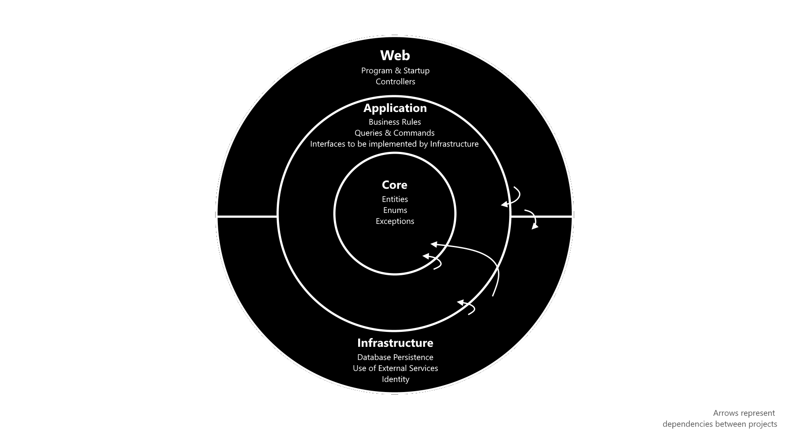

# Watson Api - Software Architecture
> [!Important]
> Work in progress

## Clean Architecture
The Watson Rest API uses a web api architecture commonly refered to as ✨Clean Architecture✨. Clean Architecture heavily follows Domain Driven Design (DDD). Our implementation of Clean Architecture exists out of the following layers:

- `src/Watson.**Core**`: All core domain entities and enums that the entire application revolves around.
- `src/Watson.**Application**`: All our business logic resides here and interfaces for external services are defined here.
- `src/Watson.**Web**`: The 'presentation layer' of our API that exposes our business logic to the client via endpoints defined in the different `Controllers`.
- `src/Watson.**Adapter.SqlServer**`: The implementation of repository and data related services. This layer sets up the connection to an SQL Server Database and contains logic to retrieve and save our Core entities to this Database.
- `src/Watson.**Adapter.OpenAI**`: The implementation of all "AI" related services using Semantic Kernel and the OpenAI API Connection.
- `src/Watson.**Adapter.Shared**`: Shared infrastructure services. Services such as a `DateTimeService` or `EmailService` could reside here.
- `tests/Watson.**UnitTests**`: All Unit tests targeted towards the Application Layer.
- `tests/Watson.**IntegrationTests**`: All Integrations tests for Watson.

These layers interact with each other and this can easily be visualised in an "Onion" Shaped Diagram:




---

## Mediator Pattern
The Watson API makes use of the Mediator Pattern and Command Query Responsibility Seperation (CQRS). To achieve this, we use the `MediatR` NuGet package.

### How does a Controller invoke a Command or Query via Mediator?
Controllers can extend the `BaseApiController` class, this will allow Controllers to make use of the `Mediator` attribute. A controller should do nothing more than pass Commands to the Mediator.

The Application layer will contain all logic. Each Feature can get their own folder inside the `Feature` folder. Let's say that we have a Todo app. We will implement our Todo features inside the folder `Features/Todo/Commands` and `Features/Todo/Queries`. We make use of the CQRS separation.

A create command for this supposed feature can live inside the `CreateTodo.cs` file. This file will contain the IRequest implementation, IRequestHandler implementation, a return view model if relevant and `AbstractValidator` implementation if validation is needed. Below is an example of how this could look.

*Application/Features/Todo/Commands/CreateTodo.cs*
```cs
    public class CreateTodoCommand : IRequest<Response<Guid>>
    {
        public string Title { get; set; }
        public string DetailedDescription { get; set; }
    }

    public class CreateTodoCommandHandler : IRequestHandler<CreateTodoCommand, Response<Guid>>
    {
        private readonly ITodoRepository _todoRepository;
        private readonly IMapper _mapper;

        public CreateTodoCommandHandler(ITodoRepository todoRepository, IMapper mapper)
        {
            _todoRepository = todoRepository;
            _mapper = mapper;
        }

        public async Task<Response<Guid>> Handle(CreateTodoCommand request, CancellationToken cancellationToken)
        {
            var todo = _mapper.Map<Todo>(request);

            await _todoRepository.AddAsync(todo);
            return new Response<Guid>(todo.Id);
        }
    }

    public class CreateTodoCommandValidator : AbstractValidator<CreateTodoCommand>
    {
        public CreateTodoCommandValidator()
        {
            RuleFor(t => t.Name)
                .NotEmpty().WithMessage("{PropertyName} is required")
                .NotNull()
                .MaximumLength(20).WithMessage("{PropertyName} must not exceed 20 characters");
        }
    }
```

A Controller can then execute this Command by simply sending this Command Object to the Mediator instance. Mediator will automagically assign the correct Handle method to our Command. An example of how a Todo Controller would look is shown below:

*Web/Controllers/v1/TodoController.cs*
```cs
[Route("[controller]")]
[ApiVersion("1.0")]
[ApiController]
public class TodoController : BaseApiController
{

    /// <summary>
    ///     Create a new Todo item.
    /// </summary>
    /// <param name="command">The necessary information to create a todo item</param>
    /// <returns code="200">Returns the new unique ID for the created todo item</returns>
    [HttpPost]
    public async Task<IActionResult> CreateTodo(CreateTodoCommand command)
    {
        return Ok(await Mediator.Send(command));
    }
}
```

Notice how we have a detailed `XML Doc` above our endpoint? The API has been set up to automatically create an OpenAPI specification based on the method descriptions that have been given with XML Doc. This way we can clearly document our API. Versioning is also baked in the API. We can simply add the `ApiVersion` attribute above the enitre Controller or per Endpoint to specify a version for the function.


## Repository Pattern
Each repository can extend the GenericRepository to implement basic features like CRUD and Pagination. Automapper mappings can be added in GeneralProfile.cs or another file that's alike.

## Auto Migrations
Migrations will run automatically. Creating Migrations will go as usual with dotnet, but make sure that you select the correct project (namely the **Adapter.SqlServer project**).