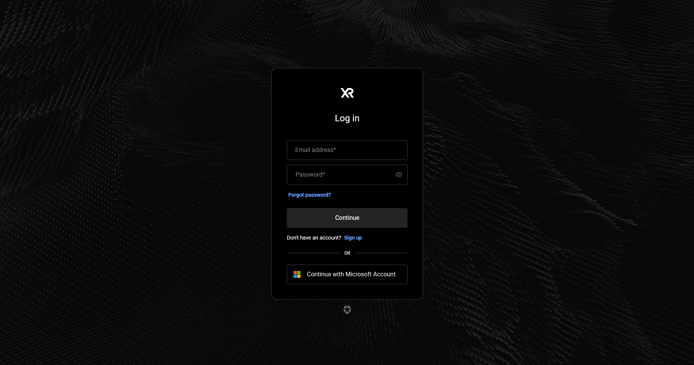

# Auth0
We use Auth0 as our Identity provider. Mainly because we were lazy to implement auth ourselves. Below are some instructions to get an Auth0 environment set up to be used in Watson.

## Create a tenant
Make sure you have an [Auth0 account](https://auth0.com/signup) and set up a new team or organisation if you're that fancy. When you create a new account, you will be prompted to set up a new development **Tenant**. You can use this tentant or create a new one from your team tenant page.

Go to your [team dashboard](https://accounts.auth0.com/teams/) and in the side menu on the left, click on **Tenants**. On this page, you can simply create a new tenant by pressing on the button in the top right corner of the page.

When you click on this button, you'll get this nice and minimal form that you can fill in to create your new Tenant. Just name your tenant to anything appropriate and write the name down somewhere, since we're going to use this later on.

After creating your new Tenant, you'll find it listed back on the Tenant page in you Team Dashboard. Make sure you click on the new Tenant, since all our configurations are going to be taking place in there from now on. 

## Application
TODO

## Api's
TODO

## App Variables and Secrets
TODO, config in our app

## Conclusion
Those are all the basic necessities you require to use Authentication using Auth0 within Watson. You can add a ton of features, social login, auth configuration and customization within Auth0 (not sponsored). You can check out the [Auth0 Developer Guides](https://developer.auth0.com/resources) to learn more on how to do this. For our purposes, we just simply added Microsoft Social Login and a neat design that fit in with our entire project.

