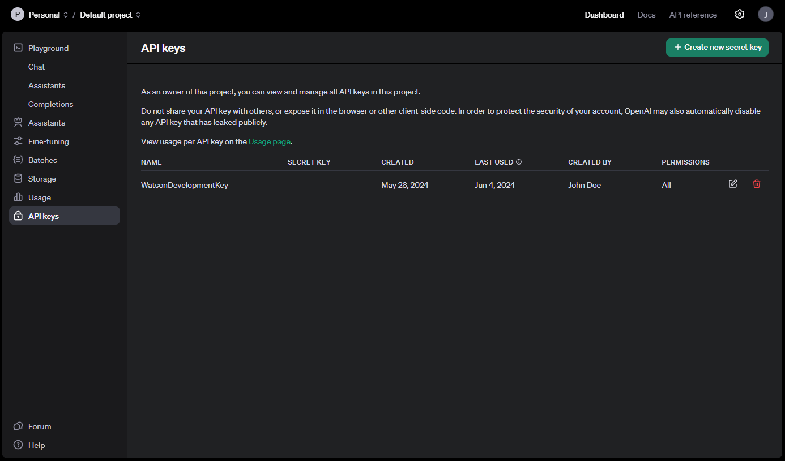

# Open AI Integration
Watson by default uses the GPT4o model through the OpenAI API. We use Semantic Kernel for all LLM related tasks, which makes it easy for you to use something else like Azure OpenAI or Huggingface. But if you want to simply out of the box run the application, well then here are the steps you need to take to connect Watson to the OpenAI API.

## Api Key
All you actually need to obtain to make everything work is an API key for OpenAI's API. They like to charge us for the requests we're making, so you actually need to set up an account for this and make sure you have funded that account in some way. If you are playing around, We recommend you fund it with the smallest amount of money possible.

Go to [platform.openai.com](https://platform.openai.com/), if you don't yet have an account you can create one to maintain your resources. If you're signed in, you can go to the **Dashboard** Menu, which you can access from the navbar. Here in the sidebar on the left, you can navigate to the **API keys** page. Or you can simply click on [this link](https://platform.openai.com/api-keys).

Within this page, you can press on the button *Create new secret key*, this is the API key we want to use. Give the secret key an appropriate name and assign it to a specific project if you want to manage it somewhere. Make sure to give this key the **All** permission. What's important is that you **never** share this key, as stated on their website.



## Use the API Key in our API
So now that we have the OpenAI API key, we can use it within Watson. Make sure you have cloned the [Watson repository](https://github.com/XR-Solutions/watson) cloned on your machine if you want to test this out locally. In case that you have Visual Studio installed, congrats. You can open the solution and right click on the **Watson.Web**. Within the context menu, you can select **Manage User Secrets**. This will open up your `secrets.json` file. You can simply add the following property within this file.

```json
{
  "OpenAISettings": {
    "ApiKey": "<the-api-key-you-got-from-openai>"
  }
}
```

In case you don't have Visual Studio installed, bummer, you can still make use of the [dotnet cli](https://learn.microsoft.com/en-us/dotnet/core/tools/dotnet). If you have the dotnet cli tool, you can run the following command within the repository.

```sh
dotnet user-secrets set OpenAISettings:ApiKey "<the-api-key-you-got-from-openai>"
```

This will in fact edit your secrets.json file with the provided content in the same way as displayed above.

## Conclusion
And that's it. That's all you need to set up yourself to get the OpenAI Infrastructure set up! Visit the guide on further [setting up your development environment](../Contributing/setup-environment.md) to run the project locally and check out your API connection.
